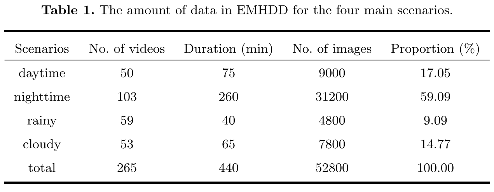

# EMHDD
Enhanced Motorcycle Helmet Detection Dataset

The dataset involves some portrait rights. If there is any infringement, please contact us to delete it.

## 1. Abstract

Compared to daytime, nighttime or other challenging scenarios present lower visibility and larger blind spots. Detection tasks in more challenging scenarios, such as nighttime, still suffer from problems such as low accuracy, which are problems that researchers need to break through. In order to push the field further in the future, we constructed a more comprehensive dataset.

Over six months, we collected urban road videos covering various scenarios such as daytime, nighttime, cloudy, and rainy conditions. We reasonably positioned several camera sampling points in both Beijing and Jinan, Shandong Province. These cameras are designed to rotate at scheduled intervals, capturing motorcycles from different angles and directions. Then, we conduct preliminary processing on the collected videos by trimming segments with prolonged absences of motorcycles and removing segments where motorcycles are only present at the edges of the camera lenses. This processing ensures the effectiveness of the data used for model training, mitigating any potential adverse impact on our model. Ultimately, we obtained 265 valid videos. From these videos, we extracted 52,800 images at a rate of 2 frames per second and further annotated these images, creating a more comprehensive dataset, which was named EMHDD (Enhanced Motorcycle Helmet Detection Dataset).

## 2. Update logs

**We are gradually opening up.**

1. This more comprehensive dataset was finally constructed through collection, screening, annotation, and other work.(`From June 2023 to December 2023`)
2. We created this warehouse to publicly disclose our work and presented relevant introductions and examples(`April 18, 2024`).
3. This dataset may have an impact on national security, and we have submitted an application to the relevant department(`April 20, 2024`). Before the application is approved, only some data examples will be provided. After approval, we will fully open the dataset.
4. We have updated some of the detector stage data in `/Detector/1. Daytime/` (`April 22, 2024`).
5. We have updated some of the recognizer stage data in `/Recognizer/1. Daytime/` (`April 22, 2024`).
6. 

## 3. Structure

~~~txt
-Detector
  --1.Daytime
    ---image
      x.jpg
      ...
    ---label
      x.txt
      ...    
  --2.Nighttime
  --3.Rainy
  --4.Cloudy

-Recognizer
~~~

## 4. Represent

### 4.1 example:

### 4.2 quantization:

## 5. Contact

If you have any questions or communication, please contact us:

* Zhiqiang Liu: 2023211273@student.cup.edu.cn
